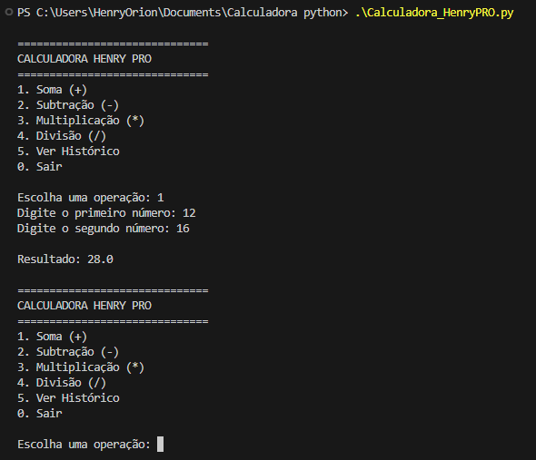

# Calculadora Henry PRO 

<p align="center">
  
</p>

Uma calculadora simples, elegante e poderosa feita em Python 

Feita com carinho em janeiro de 2026, durante uma madrugada produtiva às 3h da manhã

## Funcionalidades

- Soma, Subtração, Multiplicação e Divisão
- Proteção contra divisão por zero
- Histórico completo de todas as operações
- Tratamento de erros (não quebra nunca!)
- Interface limpa e amigável
- Totalmente personalizada com seu nome

## Como executar

1. Tenha o Python instalado (versão 3.6+)
2. Clone o repositório:

```bash
git clone https://github.com/seu-usuario/calculadora-henry-pro.git
cd calculadora-henry-pro

```

3. Execute:

``` bash

python calculadora.py

```
## Exemplo de Uso

```bash
==============================
     CALCULADORA HENRY PRO
==============================
1. Soma (+)
2. Subtração (-)
3. Multiplicação (*)
4. Divisão (/)
5. Ver Histórico
0. Sair

Escolha uma operação: 1
Digite o primeiro número: 42
Digite o segundo número: 8

Resultado: 50.0

```

## Tecnologias

Python 3
Muito amor e café

## Autor

Henry - Itatiaia, Rio de Janeiro
Desenvolvedor Python | 3h da manhã warrior
"O código funciona e tem meu nome. Missão cumprida." © Henry, 2026


## Licença
Este projeto está sob a **Licença MIT** — veja o arquivo [LICENSE](LICENSE) para detalhes completos.